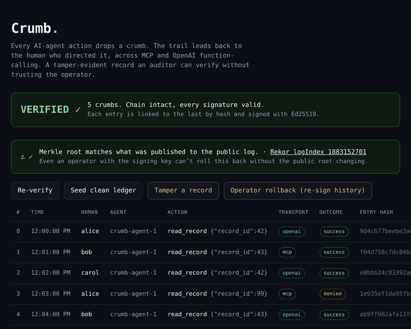

# Crumb

**Prove which human directed an AI agent's action, across MCP and OpenAI function-calling, in a tamper-evident record an auditor can verify without trusting you.**

Every agent action drops a crumb. The trail leads back to the human who directed it.

**Live demo: [crumb.alexlaguardia.dev](https://crumb.alexlaguardia.dev).** Hit *Operator rollback* and watch the signed chain stay green while the external anchor catches the forgery.



## The problem

AI agents run under service accounts and shared API keys. So when an agent reads a patient record, exports customer data, or moves money, your audit log says *the agent did it*, not *which human told it to*.

That gap is about to be illegal. The EU AI Act (Article 12, in force Aug 2 2026) requires high-risk systems to log "the identification of the natural persons involved." A service-account log can't answer that.

And it isn't a model problem you can prompt your way out of. A tool call from a model is just `{"name": ..., "arguments": ...}`, with no field for *who*. Worse, anything the model emits can be prompt-injected, so identity must never come *from* the model. It has to be stamped by the runtime, outside the agent's reasoning.

Crumb is the runtime that stamps it.

## What it is (and isn't)

Crumb is a **flight recorder** for agent actions: read-only, after-the-fact, provable. It records who-did-what and proves the record wasn't altered.

It is **not** a control plane. It doesn't block, doesn't author policy, doesn't draw an identity graph. Those are the funded lane (Cerbos, Capsule, Astrix). Crumb stays in its own: forensics and accountability, and points at them for enforcement.

## How it works

```
 human (OIDC session)
        │  sub=alice, captured once, never from the model
        ▼
   ┌─────────┐   mint RFC 8693 token (sub + act, scoped)    ┌──────────────────┐
   │ GATEWAY │ ──────────────────────────────────────────▶ │ tool / MCP server │
   └─────────┘   the enforced chokepoint                    └──────────────────┘
        │  writes a signed crumb
        ▼
   hash-chained, Ed25519-signed ledger
        │  Merkle root, hourly
        ▼
   Sigstore Rekor  (public transparency log the operator doesn't control)
```

Four moves:

1. **Capture** the human once, at an OIDC session, before the agent runs. Identity never comes from the model.
2. **Bind** every tool call to an RFC 8693-shaped delegation token carrying the human (`sub`) and the agent acting for them (`act`), scoped to one resource. The tool serves data only against a valid token.
3. **Record** a hash-chained, Ed25519-signed crumb per call. Edit, delete, or reorder any entry and a different check breaks at the exact row.
4. **Anchor** the Merkle root of the whole log to Sigstore's public Rekor log. Per-entry signatures stop a forger without the key. Anchoring stops the *operator*, who could otherwise re-sign a rewritten history.

**Cross-vendor by design.** An OpenAI function-call and an MCP `tools/call` are two different wires with the same gap: neither carries the human. Both normalize to one `ToolCall`, flow through the same gateway, and land in one canonical crumb schema, distinguished only by a `transport` field. Attribution is a property of the runtime, not the wire, so it survives a change of wire.

## Quickstart

```bash
pip install -r requirements.txt

python -m crumb.demo               # the gap, then the gateway closing it
python -m crumb.cross_vendor_demo  # same action over OpenAI + MCP, one schema
python -m crumb.tamper_demo        # write crumbs, verify, edit one, watch it break
python -m crumb.anchor_demo        # the operator rollback the anchor catches
python -m crumb.verify             # re-verify the ledger on its own

uvicorn crumb.web:app --port 8730  # the timeline view + live tamper/rollback
```

What each one shows:

- **demo**: a human authenticates, an agent reads a "regulated" record, and the crumb ties the action back to them.
- **cross_vendor_demo**: the same read driven once as an OpenAI function-call and once as an MCP `tools/call`. Both trace to the same human in one schema.
- **tamper_demo**: a careless edit. Verification catches it at the exact row.
- **anchor_demo**: the one to watch. A key-holding operator rewrites a crumb *and re-signs the entire chain*, so per-entry `verify` passes the forgery. The Rekor anchor catches it, because the rewritten root is not the one already public.

## Honest scope

- Attribution is only as good as the gateway's interposition. Bypass the proxy and attribution is void. The demo enforces the chokepoint; the tool refuses calls without a valid token.
- OpenAI function-calling has zero native identity. The binding is a runtime convention, not a protocol guarantee. Crumb secures a runtime, not a wire format.
- MCP attribution is permitted by the spec but rarely implemented. Crumb stamps the record, but it can't force a non-compliant upstream to *act* on the human identity.
- The token is RFC 8693-*shaped* and minted with a dev key. Production swaps that for a real token exchange against an IdP (Keycloak/Zitadel/Auth0). It changes the issuer, not the demo.

## Built on

OAuth 2.1 + PKCE, OIDC, [RFC 8693](https://www.rfc-editor.org/rfc/rfc8693) token exchange, [RFC 8707](https://www.rfc-editor.org/rfc/rfc8707) resource indicators, the [MCP authorization spec](https://modelcontextprotocol.io), [RFC 6962](https://www.rfc-editor.org/rfc/rfc6962) Merkle trees, and [Sigstore Rekor](https://docs.sigstore.dev/logging/overview/). Ed25519 + SHA-256 via `cryptography`, JWTs via `PyJWT`. All real, all standard.

Full design in [`SPEC.md`](./SPEC.md).
